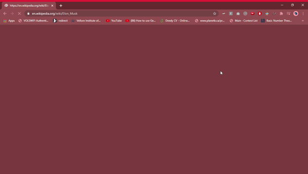

# TypeGuess
A google chrome extension to play a simple text based game. By clicking on it , the extension will provide you with the definition of a  word that it has selected and you will be asked
to guess the word . You will also be provided the (levenstien) distane of minimum edits (deleting or replacing characters) , needed in your current guess to covert it into correct guess.

## Installation
Download the repo.
- I) Open chrome , select options -> more tools -> extension
- II) Select developer mode . Select load unpacked extension
- III) Browse to the location of repo downloaded

## Usage
- Choose your preferable page and click on the extension's icon.
- Use the input field to guess the word . 
- You can scroll through the page if you want to look for the word. (Avoid clicking anywhere as it will cause the popup to close)

 

## Requirements
-Google Chrome

